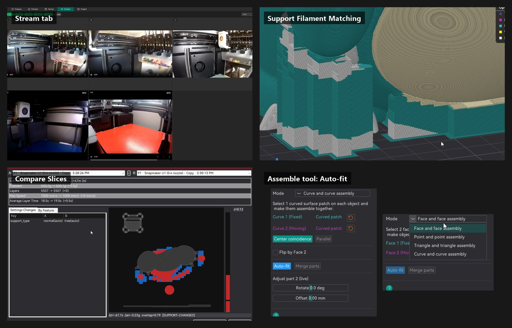
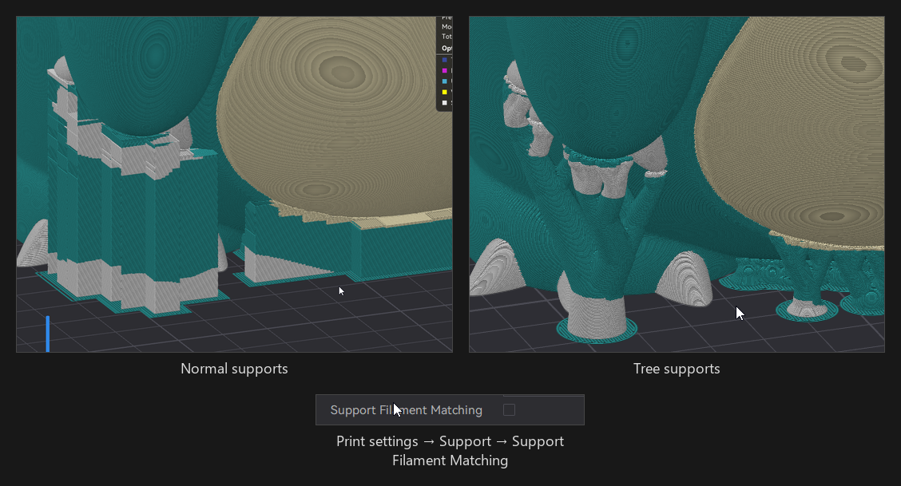
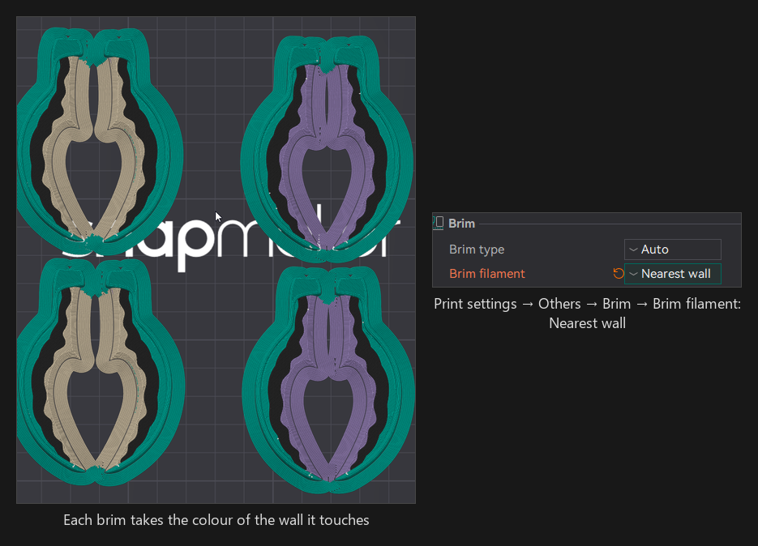
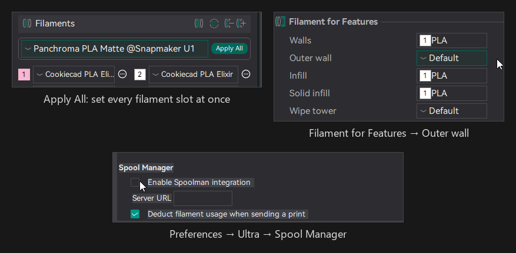
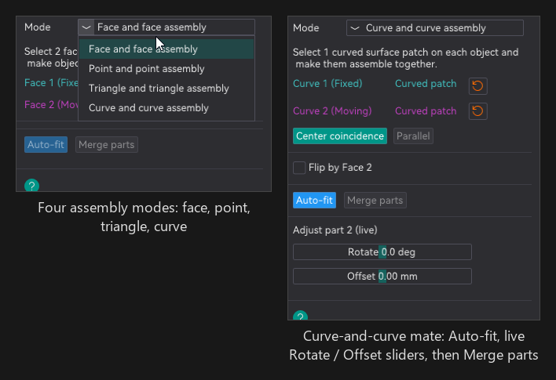
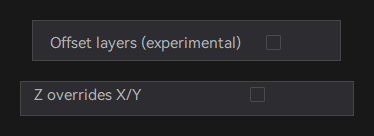
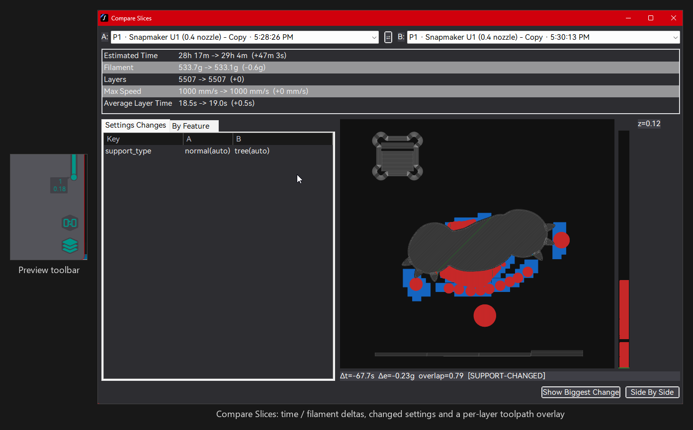
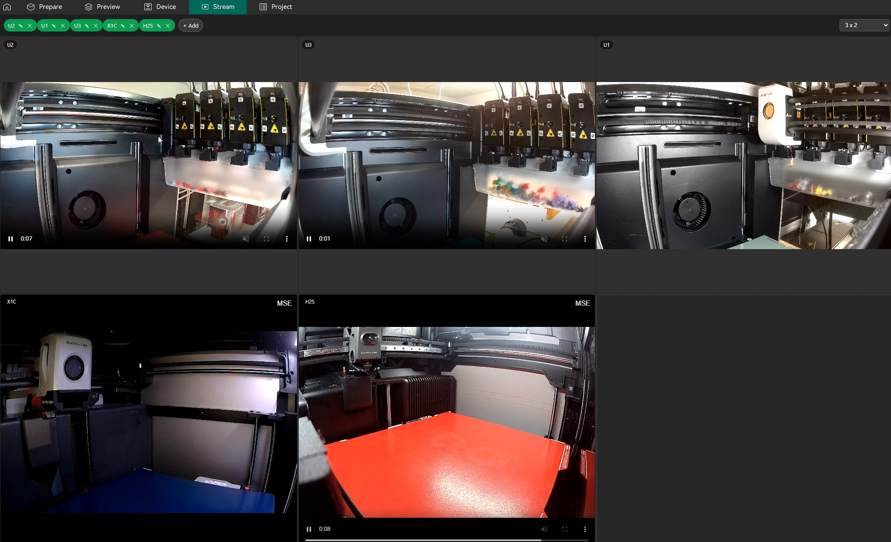

# Snapmaker-Ultra

**Bleeding edge featureset, pulled from all slicing worlds. Camera streams, filament manager, expanded printer profiles, expanded assembly and multicolor toolsets.**

[Releases](https://github.com/aceRage/Snapmaker-Ultra/releases) · Windows installer & portable · Linux AppImage · macOS (unsigned) · Based on [Snapmaker Orca](https://github.com/Snapmaker/OrcaSlicer) 2.3.6 (the app still reports itself as Snapmaker Orca 2.3.6.x) · AGPL-3.0



Snapmaker-Ultra keeps everything Snapmaker Orca does — Snapmaker U1 / J1 / Artisan / A-series support and the full OrcaSlicer printer library — and adds features pulled from Bambu Studio, OrcaSlicer pull requests and our own work.

---

## Highlights

### Bambu Lab, including dual-nozzle — in progress

- **Profiles** for H2D, H2D Pro, H2C and X2D (dual-nozzle) plus P2S, A2L and H2S, with the full official Polymaker filament catalogue.
- **Dual-nozzle slicing** — filaments are grouped onto nozzles automatically (from the connected printer's AMS layout when one is attached), cross-nozzle changes skip the purge, and the grouping is saved in the project 3MF.
- **Nozzle flow type** (Standard / High Flow) is declared in sliced files and matched to the installed nozzle at send time.
- **Import Bambu Studio user presets** — one-way mirror of your custom print / filament / machine presets, at startup or via *Sync now*.
- **Printer connectivity** — an optional network / printer-connectivity plugin, developed separately and not part of this repository, adds live status, camera and send-to-printer for supported Bambu Lab machines (Preferences → Ultra → Bambu Network).
- **Status:** slicing is verified; physical validation on Bambu hardware is still in progress — treat this group as beta.

### Multicolor and materials

- **Support Filament Matching** (opt-in) — supports, interfaces, ironing and brims print in the colour of the surface they touch; **Brim filament → Nearest wall** for brims alone.
- **Outer wall filament** separate from inner walls.
- **Filament colours and count survive printer switches**; **Apply All** sets every filament slot in one click; **per-filament Z offset**.
- **Spool Manager** — [Spoolman](https://github.com/Donkie/Spoolman) inventory, spool-to-slot bindings, automatic usage deduction when a job is sent.





### Assembly and fitting

- **Auto-Fit Assembly** — right-click a multi-selection: the largest part stays fixed, the rest mate to it by matching faces, holes and pegs, and everything merges into one print-ready object.
- **Assemble tool → Auto-fit** — pick one feature on each part (flat face, circular rim, a single triangle or a curved patch), press *Auto-fit*, nudge with the live **Rotate / Offset** sliders, then **Merge parts**. Rotation is chosen by outline fit *and* a whole-mesh collision check, so pegs seat square without intersecting.
- New assembly modes **Triangle and triangle** and **Curve and curve**; **Point and point** snaps to vertices at any zoom and has one-click **Coincide points**.



### Modeling and Prepare view

- **Mesh booleans** on the Manifold backend (automatic fallback) with a part picker; **Repair/Remesh** rebuilds any part watertight.
- **Visibility** — Normal / Ghost (X-ray) / Hidden per object or part, with an eye column in the object list.
- **Move panel align & distribute**, **bottom-referenced Z**, **keep imported Z** (drop-to-bed toggle), double-click to select a part.
- **Assemble Separately / Separate** parts out of an assembly in place; **Merge into Single Part** keeps paint and seam annotations.

### Print quality

- **Offset layers** (experimental), **Print unsupported walls last**, **Undertop surface pattern**, **Z overrides X/Y** support option, **machine prepare time** in estimates, deterministic toolpaths.



### Workflow and UX (Preferences → Ultra)

- **Auto-Save project**, **Keep my printer when opening project files**, **Skip Settings Mapping Warnings**, **Prefer Last Used Print Profile**, **Seamless System Filament Edits**.
- **Compare Slices** (View menu) — settings, time and filament diff plus per-layer toolpath comparison of any two slices or sliced files.
- **Import Config from G-code**, `orcaslicer://` links, silent exit.
- **Stream tab** — live camera wall up to 9×9 for Snapmaker U1, Moonraker, Bambu Lab (LAN liveview) and Flashforge cameras, plus any RTSP / ONVIF IP camera (Reolink, Amcrest, Hikvision, Tapo, …; Wyze via RTSP firmware or wyze-bridge) with LAN discovery; drag names to reorder; bundles the open-source [go2rtc](https://github.com/AlexxIT/go2rtc) helper.





### Fixes to upstream issues

Plate deletion during a slice no longer crashes; fuzzy skin no longer leaves dots or seam blobs; JSON profiles with unquoted numbers/booleans keep their settings; Repair no longer produces inside-out meshes; forced preset and U1 → U1 device switches no longer pop the transfer/discard dialog; the false nozzle-mismatch nag on Bambu sends is gone.

---

## Supported printers

| Family | Status |
|---|---|
| **Snapmaker** U1, J1, Artisan, A250 / A350 (Dual, Quick Swap, Bracing Kit variants) | Inherited from Snapmaker Orca; **physically validated on the U1** |
| **Bambu Lab** A1 mini, A1, A2L, P1P, P1S, P2S, X1, X1 Carbon, X1E, H2S, H2D, H2D Pro, H2C, X2D | **In progress** — slicing verified, physical validation pending |
| **Flashforge** Creator 5, Creator 5 Pro | Profiles only |
| OrcaSlicer vendor library (Creality, Prusa, Voron, QIDI, Anycubic, Elegoo, Sovol, …) | Unchanged from upstream (QIDI / Anycubic refreshed) |

---

## Download and install

All builds are on the [Releases](https://github.com/aceRage/Snapmaker-Ultra/releases) page.

- **Windows (64-bit) installer** — `Snapmaker-Ultra_Windows_Installer_V<version>.exe`. Installs **side by side** with the official Snapmaker Orca (own folder, Start-menu entry and Add/Remove entry) and upgrades a previous Snapmaker-Ultra install. The splash screen shows *Ultra version* so the two are easy to tell apart.
- **Windows portable** — `Snapmaker-Ultra_Windows_V<version>_portable.zip`: unzip and run `snapmaker-orca.exe` (needs the Edge WebView2 runtime and the VC++ redistributable, usually already present).
- **Linux (x86_64)** — `Snapmaker_Orca_Linux_V<version>.AppImage`: `chmod +x` and run. The host must provide WebKitGTK 4.1 and libOpenGL (Ubuntu: `libwebkit2gtk-4.1-0 libopengl0`); they are not bundled.
- **macOS (Apple silicon)** — the `.dmg` is **unsigned** (no Apple Developer account yet), so macOS refuses it the first time: right-click the app → *Open* → *Open*, or run `xattr -dr com.apple.quarantine "/Applications/Snapmaker Orca.app"` once.

The Windows packages include the connectivity plugin; the Linux and macOS builds currently do not.

---

## Build from source

Same toolchain as Snapmaker Orca / OrcaSlicer (CMake, C++17, wxWidgets); deps build into `deps/build/`, the slicer into `build/`.

```bash
build_release_vs2022.bat            # Windows: VS 2022, CMake <= 3.31, git-lfs, Strawberry Perl (deps | slicer | debug)
./build_release_macos.sh            # macOS: -d deps, -s slicer, -a arm64|x86_64|universal
./build_linux.sh -u && ./build_linux.sh -dsi   # Linux: system deps, then deps + slicer + AppImage
./build_flatpak.sh                  # Flatpak
cd build && ctest --output-on-failure          # tests (Catch2)
```

Windows packaging: `cpack -G NSIS` in `build/` produces the installer (needs NSIS); zip `build/Snapmaker_Orca/` for the portable build. The optional connectivity plugin lives outside this tree and is only built when `src/ultranet/CMakeLists.txt` exists, so the repository builds without it. Run `git lfs pull` after cloning on Windows. See [`CLAUDE.md`](CLAUDE.md) and [`AGENTS.md`](AGENTS.md) for details.

---

## Status and roadmap

| Release | Date | Highlights |
|---|---|---|
| [v2.3.6.4-ultra](https://github.com/aceRage/Snapmaker-Ultra/releases/tag/v2.3.6.4-ultra) | 2026-09-01 | Windows installer (side by side), Linux AppImage, unsigned macOS build; assembly tools (Auto-Fit, Assemble-tool Auto-fit with live sliders, triangle/curve/point modes); dual-nozzle grouping; H2D/H2C/X2D/P2S/A2L/H2S profiles + Polymaker catalogue; Support Filament Matching; Bambu Studio preset import |
| [v2.3.6.3-ultra](https://github.com/aceRage/Snapmaker-Ultra/releases/tag/v2.3.6.3-ultra) | 2026-08-30 | Connectivity-plugin update, Compare Slices, go2rtc cleanup on exit |
| [v2.3.6.2-ultra](https://github.com/aceRage/Snapmaker-Ultra/releases/tag/v2.3.6.2-ultra) | 2026-08-29 | Bambu LAN connectivity (optional plugin), nozzle flow type, QIDI refresh |
| [v2.3.6.1-ultra](https://github.com/aceRage/Snapmaker-Ultra/releases/tag/v2.3.6.1-ultra) | 2026-08-28 | Outer wall filament, Spool Manager, Offset layers, Visibility modes, Manifold booleans, Repair/Remesh |
| [v2.3.6-ultra](https://github.com/aceRage/Snapmaker-Ultra/releases/tag/v2.3.6-ultra) | 2026-08-27 | Stream tab, Keep my printer, Auto-Save, Apply All, Assemble Separately, align helpers |

**In progress (separate branches):** `feat/paint-depth` — bounded embedding depth for multi-material paint. Flashforge device tab — experimental; the send flow is incomplete and it needs the vendor's own network library, which is **not** distributed with this fork. Dual-nozzle follow-ups — nozzle-aware tool ordering and per-nozzle AMS slot mapping in the send dialog. Next: the Ultra splash and side-by-side identity on the Linux and macOS builds.

---

## Lineage and licence

Snapmaker-Ultra is licensed under the **GNU Affero General Public License, version 3** ([`LICENSE.txt`](LICENSE.txt)). It is a fork of [Snapmaker Orca](https://github.com/Snapmaker/OrcaSlicer) (Snapmaker), based on [OrcaSlicer](https://github.com/SoftFever/OrcaSlicer) by SoftFever, based on [Bambu Studio](https://github.com/bambulab/BambuStudio) by Bambu Lab, based on [PrusaSlicer](https://github.com/prusa3d/PrusaSlicer) by Prusa Research, based on [Slic3r](https://github.com/Slic3r/Slic3r) by Alessandro Ranellucci and the RepRap community; OrcaSlicer also incorporates features from SuperSlicer by @supermerill. All are AGPL-3.0: if you use any part of this software in any way, even behind a web server, your software must be released under the same licence.

Ported features: align/distribute helpers, "Sub merge" (our *Assemble Separately*) and *Z overrides X/Y* from Bambu Studio; *Print unsupported walls last* (#15411), *Merge into Single Part* (#15413), *Undertop surface pattern* (#15389), the JSON-config fix (#15370), per-filament Z offset (#4660), drop-to-bed / bottom-referenced Z (#8194, #5315), machine prepare time (#5796) and the Flashforge Creator 5 profiles (#13259) from OrcaSlicer; the Flashforge device stack from the Orca-Flashforge project.

Third-party components added by this fork: [Manifold](https://github.com/elalish/manifold) (Apache-2.0); [go2rtc](https://github.com/AlexxIT/go2rtc) v1.9.14 (MIT, bundled unmodified in `resources/tools/go2rtc`); Polymaker presets from [Polymaker3D/Polymaker-Preset](https://github.com/Polymaker3D/Polymaker-Preset) (MIT, notice in `resources/profiles/BBL/filament/PANCHROMA_POLYMAKER_LICENSE.txt`); the pressure-advance calibration pattern adapted from Andrew Ellis' generator (GPL-3.0), itself adapted from Sineos' Marlin generator (GPL-3.0). No proprietary printer-vendor network libraries are included in this repository.

Snapmaker, Bambu Lab, Flashforge and other printer brands are trademarks of their respective owners; this project is not affiliated with or endorsed by any of them.

---

## Contributing

Bug reports and feature requests go to [GitHub Issues](https://github.com/aceRage/Snapmaker-Ultra/issues) — include the release version, printer and a project `.3mf` where possible. Pull requests target **`main`**; read [`AGENTS.md`](AGENTS.md) for layout and conventions, keep fork-specific settings on the Ultra preferences tab, and prefer porting from upstream with attribution over re-implementing.

Security issues: please use a [private security advisory](https://github.com/aceRage/Snapmaker-Ultra/security/advisories/new) on GitHub rather than a public issue.
